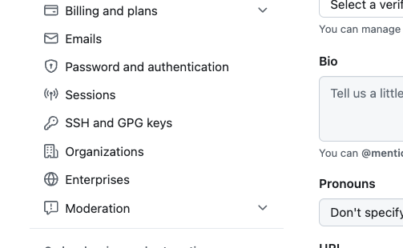
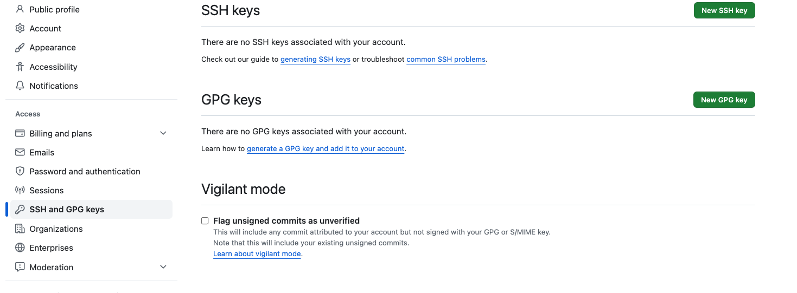
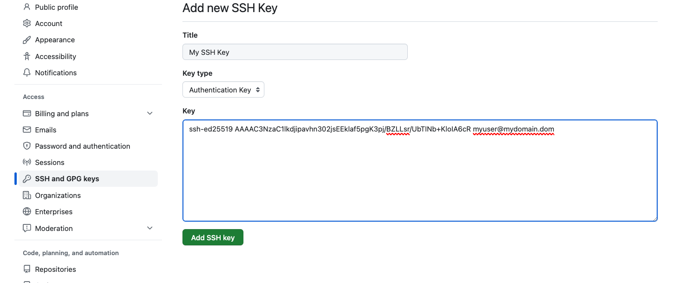
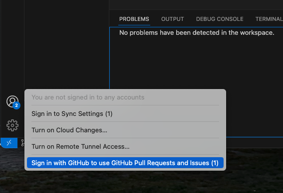
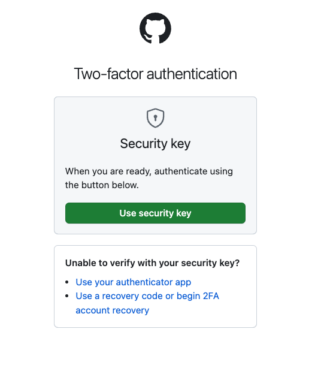
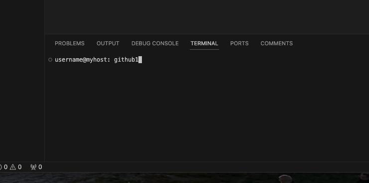
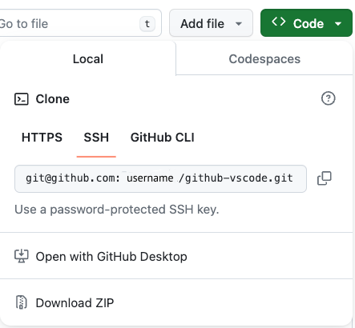
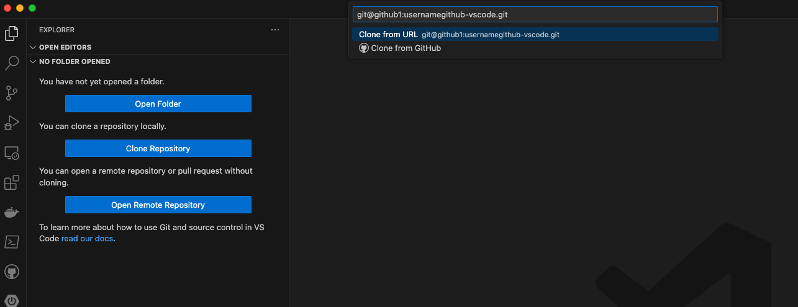

# github-vscode

##
These notes document the process to integrate VScode with GitHub on MacOS Sonoma

Concepts and Tools

* Create SSH keys (tools:  ssh-keygen ssh-add)
* Add new keys to the SSH Keychain
* Add Public Key to GitHub
* Create SSH Config Files
* Create scripts to set SSH user.name & user.email
* Using the keys in VScode
##

## Create SSH Keys

> ssh-keygen -t ed25519 -f /Users/username/.ssh/id_mykey_1

-t ed25519 option creates an ed25519 keypair, more secure than RSA

-f outputs the SSH key to an oputput file.

**Continue for other GitHub Accounts**

> ssh-keygen -t ed25519 -f /Users/username/.ssh/id_mykey_2
##

## Add SSH Keys to the KeyChain

For each key created, add the SSH key to your Keychain

> ssh-add ./id_mykey1
>
> ssh-add ./id_mykey2

You can confirm the keys in your Keychain

> ssh-add -l
##

## Add Public SSH Keys into GitHub Account
- Log into your first git hub account and enter account ***Settings***
##

***
- On the *Settings* navigation panal, select ***SSH and GPG keys***

***
Select the ***Add Key*** button

***
Add the SSH Key information for ***id_mykey1.pub*** file

- Now do the same for the remaining accounts.

##

## Create SSH Config File
In the /Users/username/.ssh folder, create a new config file if it doesn't exist

> touch config

Edit the file with your favorite text editor (vi, vim, nano, ...)
adding the same block for each GitHub Account

> nano config

Add the following lines for GitHub Account 1

>  \# GitHub account 1
>  Host github_1
>  HostName github.com
>  User git
>  IdentityFile ~/.ssh/id_id_mykey_1

Add the following lines for GitHub Account 2

>  \# GitHub account 2
>  Host github_2
>  HostName github.com
>  User git
>  IdentityFile ~/.ssh/id_id_mykey_2

Save the file.

##

## Create scripts to set SSH user.name & user.email

To switch between GitHub accounts, you may receive error messages regarding you global variables for user.name and user.email global variables.  The switching can be accomplished with some VScode extentions or creating local scripts to execute.  

Start by creating a folder to store the personal script files.  Optionally, you can add these scripts to the /usr/local/bin folder.

> mkdir /Users/username/bin

In the PATH, create an entry for /Users/username/bin

This can be accomplished by adding the following line to the /Users/username/.bash_profile file.

> export PATH=$PATH:/Users/username/bin

### Global Variable Script

For each GitHub Account, create a script file that changes the global user.name and user.email values.  In this example we will create *github1* and *github2* files in the /Users/username/bin folder.

***

> nano /Users/username/bin/github1

> git config --global user.name "\<*GitHub username 1*>"
> git config --global user.email "\<*GitHub email address 1*>"

***

> nano /Users/username/bin/github2

> git config --global user.name "\<*GitHub username 2*>"
> git config --global user.email "\<*GitHub email address 2*>"

***

### Make the script files executible

> chmod +x github1
>
> chmod +x github2

##

## Using VScode / SSH configurations

This section reviews the process to login and set the global variables to access GitHub via SSH

***

### Sign into GitHub through VScode

Open the ***Accounts*** feature At the bottom left of VScode and select *Sign in with GitHub...* option.

***

#### Login to GitHub using your account credentials

***

#### If your account is configured with 2FA, respond to the 2FA challenge

***

#### Run the Global user variable scripts

In the VScode *terminal* run the Global Variable script for the account logged in.  In this example, we logged into our first GitHub account -  *github1* script

***

##

## Cloning a Repository

In GitHub, copy the *SSH* link in the ***Code*** button, NOTE: **SSH** not the **HTTPS** selection

***

In the Folders section, clone a repository by selecting the ***Clone Repository*** button.  In the Command Palette, the prompt for *Clone from URL* paste in the SSH address from GitHub.

Modify the SSH URL by changing the hostname *github.com* with the hostname refereenced in the ~/.ssh/config file, i.e. ***github1***

###Viola 

